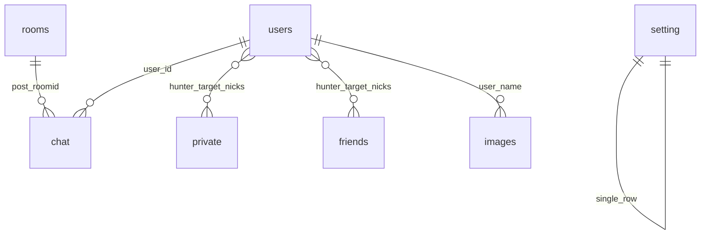

# Схема бази даних `org100h` (board.te.ua)

**Джерело:** дамп phpMyAdmin у файлі [org100h.sql](org100h.sql).  
**Оновлено за змістом дампу:** 2026-03-20 (мітка часу в заголовку SQL: MySQL 8.0.45).  
**Оновлення документації:** 2026-03-20 — додано [рекомендації з оптимізації](#db-optimizations) (індекси, плани запитів, utf8mb4, архів).

Після цього документа ви матимете уявлення, які таблиці існують, як вони логічно пов’язані з функціями чату, які обмеження має схема з точки зору цілісності даних, і які кроки варто розглянути для продуктивності під навантаженням.

---

## 1. Що це за артефакт

- Це **повний експорт** структури та даних (не лише DDL), придатний для відновлення БД командою імпорту в MySQL/MariaDB.
- У сесії встановлено `utf8mb4`, але **таблиці створені з `DEFAULT CHARSET=utf8mb3`** — типовий спадок старіших версій MySQL/движка чату.
- Движок таблиць: **InnoDB** для всіх перелічених таблиць.
- **Зовнішні ключі (FOREIGN KEY) у дампі відсутні.** Зв’язки між сутностями підтримуються на рівні застосунку (узгоджені імена полів: `user_id`, `post_roomid`, ніки в `hunter`/`target` тощо).

**Увага:** файл містить реальні або наближені до бойових дані (IP, email, хеші паролів, повідомлення). Не публікуйте дамп у відкритих репозиторіях і не використовуйте його як «демо» без очищення PII.

---

## 2. Огляд таблиць і ролей

| Таблиця | Призначення |
|--------|-------------|
| `users` | Облікові записи: нік, пароль, email, профіль, кімната, ранг, ігнор-лист, соцмережі тощо. |
| `chat` | Публічні повідомлення кімнат (HTML у тілі, тип повідомлення, кімната). |
| `rooms` | Кімнати чату: назва, топік (HTML), рівень доступу. |
| `private` | Приватні повідомлення між користувачами (за ніками відправника/отримувача). |
| `friends` | Запити/зв’язки дружби (`hunter` → `target`, статус). |
| `images` | Реєстр завантажених файлів (ім’я файлу, час, нік). |
| `setting` | Єдиний «широкий» рядок глобальних налаштувань сайту (Boomchat-подібна модель). |
| `theme` | Доступні теми оформлення (ідентифікатор + назва). |
| `banned` | Список заблокованих IP. |
| `filter` | Слова для фільтрації контенту. |
| `facebook` | Параметри інтеграції Facebook (у дампі є app id / secret — **секрети потрібно ротувати**, якщо файл утек). |
| `player` | Налаштування медіаплеєра (URL стріму, прапорці увімкнення). |
| `addons` | Заготовка під додатки (у цьому дампі лише структура, без рядків даних). |

---

## 3. Ключі та індекси

Усі таблиці мають **первинний ключ** на одному стовпці; для числових ідентифікаторів у кінці дампу вмикається **AUTO_INCREMENT** (наприклад, наступний `post_id` для `chat`, `user_id` для `users`).

Додаткових індексів (наприклад, на `user_id` у `chat` або на пару `hunter`/`target` у `private`) у фрагменті дампу **не видно** — для великих обсягів історії чату варто перевіряти плани запитів на реальному сервері. Конкретні пропозиції індексів і супутні кроки — у [розділі 8](#db-optimizations).

---

## 4. Деталі по важливих таблицях

### 4.1. `users`

Центральна сутність користувача.

- **Ідентифікація:** `user_id`, `user_name`, `user_password` (у даних — bcrypt `$2y$10$...`), `user_email`.
- **Сесія та активність:** `user_ip`, `user_join`, `last_action`, `last_message`, `session_id`.
- **Чат і модерація:** `user_roomid` (посилання на `rooms.room_id` за змістом), `user_color`, `user_rank`, `user_access`, `user_kick`, `user_mute`, `mute_time`, `user_flood`.
- **Профіль:** `user_avatar`, `user_tumb`, `user_description`, `alt_name`, `user_sex`, `user_age`, `country`, `region`, `city`, кастомні поля `custom1` / `custom2`.
- **Соціальне:** `user_friends` (схоже на збережений список/рядок), `user_ignore`, окремі поля під соцмережі та `fb_id`, `bridge`.
- **Гість:** `guest`, `verified`, `valid_key`, лічильники (`upload_count`, `pcount`, `email_count` тощо).

Спеціальні облікові записи в логіці чату можуть використовувати зарезервовані `user_id` (наприклад, у стрічці `chat` зустрічається системний постер з `user_id = 999999` і ніком на кшталт «RedPanda»).

### 4.2. `chat`

Повідомлення публічного чату.

| Поле | Зміст (логічний) |
|------|-------------------|
| `post_id` | Первинний ключ, автоінкремент. |
| `user_id` | Автор (зв’язок з `users.user_id` за угодою). |
| `post_date` | Unix timestamp. |
| `post_time` | Рядок часу для відображення (наприклад `20:54`). |
| `post_user` | Нік на момент поста (денормалізація). |
| `post_message` | Текст/HTML (посилання, смайли, згадки). |
| `post_color` | Клас/роль відображення (`user`, `vip`, `sadmin`, `system` тощо). |
| `post_roomid` | Кімната (`rooms.room_id`). |
| `type` | Наприклад `public` або `system`. |
| `post_target` | Додаткова адресація (наприклад для згадок або спецтипів). |
| `avatar` | Файл мініатюри аватара для рядка. |
| `file` | Для вкладень: у даних ненульове значення збігається з timestamp завантаження; `0` — без файлу. |

### 4.3. `rooms`

- `room_id`, `room_name`, `topic` (HTML), `access` (ціле; рівні доступу до кімнати в логіці додатка).

### 4.4. `private`

Приватна переписка.

- Учасники задаються рядками **`hunter`** (відправник) та **`target`** (отримувач) — це **ніки**, не обов’язково FK на `users.user_name`.
- `message` — тіло (може містити HTML, зокрема зображення).
- `status`, `view`, `hunter_guest`, кольори ролей (`hunter_color`, `target_color`), `avatar`, `file` (аналогічно до чату для медіа).

### 4.5. `friends`

- `hunter`, `target` — ніки; `status` — стан заявки/дружби (у вибірці даних зустрічаються `0` та `1`).

### 4.6. `images`

Журнал завантажень: `file_name` (зазвичай хешоване ім’я у сховищі), `date_sent` (Unix time), `user_name`.

### 4.7. `setting`

Один рядок з великою кількістю прапорців і лімітів — характерно для **Boomchat**: реєстрація, технічні роботи, антифлуд, довжини повідомлень/ніка/пароля, ліміти історії, домен, мова, гості, реклама, звук, тема за замовчуванням, SEO-поле `meta` тощо. Поле `version` у даних дорівнює `70` (версія пакета/скрипта в термінології оригінального продукту).

### 4.8. Допоміжні таблиці

- **`theme`:** `id`, `name` (наприклад `Dark`, `orange`).
- **`banned`:** `id`, `ip`.
- **`filter`:** `id`, `word`.
- **`facebook`:** прапорець логіну та ключі API (чутливі дані).
- **`player`:** чи увімкнений плеєр, статус, URL потоку.
- **`addons`:** `id`, `name` — без даних у цьому дампі.

---

## 5. Логічна модель (без FK)



Зв’язки **`private`** / **`friends`** з `users` умовні: застосунок має узгоджувати ніки та id без гарантій з боку СУБД.

---

## 6. Імпорт і відновлення

1. Створіть порожню базу (наприклад `org100h`) з кодуванням, сумісним з дампом.
2. Імпортуйте файл: `mysql -u ... -p org100h < org100h.sql`
3. Перевірте `AUTO_INCREMENT` та наявність даних у `setting` і `users`.

Якщо ви мігруєте на `utf8mb4` на рівні таблиць, потрібен окремий план конвертації (можливі обмеження довжини індексів для `varchar`).

---

## 7. Пов’язана документація в цій папці

- [SITE-STRUCTURE.md](SITE-STRUCTURE.md) — будова UI сайту.
- [PRIVATE-MESSAGES.md](PRIVATE-MESSAGES.md) — поведінка приватів у інтерфейсі.
- [CHAT-PANEL-SIDEBAR.md](CHAT-PANEL-SIDEBAR.md), [CHAT-MAIN-INPUT.md](CHAT-MAIN-INPUT.md) — панель і введення в чаті.

---

<a id="db-optimizations"></a>

## 8. Рекомендації з оптимізації (MySQL / InnoDB)

Нижче — зміни, орієнтовані на типові запити чату (стрічка кімнати, історія, приват, друзі) і на обмеження поточної схеми з розділу «Ключі та індекси». Усе потрібно **узгодити з реальними SQL у PHP Boomchat** і перевірити через `EXPLAIN` / `EXPLAIN ANALYZE` (MySQL 8.0) на копії БД з продакшен-подібним обсягом.

### 8.1. Індекси (найвищий пріоритет)

Таблиця **`chat`** — найбільший обсяг рядків; без складеного індексу під фільтр кімнати та сортування за часом запити на «останні N повідомлень у кімнаті» часто перетворюються на **повне сканування** або неоптимальне сортування.

| Пріоритет | Таблиця | Індекс (приклад) | Навіщо |
|-----------|---------|------------------|--------|
| Високий | `chat` | `(post_roomid, post_date DESC)` або `(post_roomid, post_id DESC)` | Вибірка стрічки кімнати за часом/ідентифікатором. `post_id` корелює з порядком, якщо вставки монотонні. |
| Високий | `chat` | `(user_id, post_date)` або `(user_id, post_id)` | Профіль/модерація/пошук постів користувача. |
| Середній | `private` | `(target, time DESC)` та `(hunter, time DESC)` | Список вхідних/вихідних приватів за ніком (як у схемі — без FK на `users`). |
| Середній | `friends` | `(hunter, status)`, `(target, status)` | Панель друзів і заявки без повного скану. |
| Середній | `images` | `(user_name, date_sent DESC)` | Галерея/історія завантажень по користувачу. |
| Низький | `banned` | `UNIQUE(ip)` або звичайний `INDEX(ip)` | Швидка перевірка бану по IP (переконайтесь, що дублікати IP не ламають UNIQUE). |
| Низький | `users` | `UNIQUE(user_name)` (якщо логіка допускає і дані чисті) | Гарантія унікальності ніка на рівні БД + швидкий логін по ніку. |

Приклад додавання індексу в MySQL 8.0 (онлайн-орієнтований варіант):

```sql
-- Перевірте план ДО змін:
-- EXPLAIN ANALYZE SELECT ... FROM chat WHERE post_roomid = 1 ORDER BY post_date DESC LIMIT 200;

ALTER TABLE chat
  ADD INDEX idx_chat_room_date (post_roomid, post_date DESC);

ALTER TABLE private
  ADD INDEX idx_private_target_time (target, time DESC),
  ADD INDEX idx_private_hunter_time (hunter, time DESC);
```

**Застереження:** кожен індекс сповільнює `INSERT`/`UPDATE` і займає місце на диску. Не дублюйте індекси, які вже покриваються лівим префіксом іншого (наприклад, окремий індекс лише на `post_roomid` зазвичай **зайвий**, якщо є `(post_roomid, post_date)`).

### 8.2. Плани запитів і типові пастки

- Після додавання індексів повторіть **`EXPLAIN ANALYZE`** для: останніх повідомлень кімнати, архіву з пагінацією, вибірки приватів для одного ніка.
- Уникайте **`SELECT *`** у гарячих ендпоінтах, якщо додаток запитує всі стовпці `chat`/`users` без потреби — менше IO і кешу.
- **`post_message` (TEXT)** не входить у покривні індекси для повного рядка; пошук по тексту вимагає окремого рішення (`FULLTEXT` у InnoDB з обмеженнями по мові/stopwords, або зовнішній пошуковий рушій) — вмикайте лише за реальною вимогою.

### 8.3. Цілісність даних і зовнішні ключі

Зараз зв’язки **тільки в додатку**. Опційне посилення:

- Додати `FOREIGN KEY (user_id) REFERENCES users(user_id)` для `chat` і/або `FOREIGN KEY (post_roomid) REFERENCES rooms(room_id)` — лише після **очищення сирот** (пости з неіснуючим `user_id` або кімнатою; системні `user_id` на кшталт `999999` потрібно або завести в `users`, або виключити з FK).
- Для `private`/`friends` FK по нікам **не природні**; довгостроково варто розглянути стабільні ключі (`user_id` відправника/отримувача) — це вже рефакторинг додатка, не лише БД.

### 8.4. Кодування: `utf8mb3` → `utf8mb4`

Для повної підтримки Unicode (емодзі тощо) таблиці варто перевести на **`utf8mb4`**. Робіть поетапно на копії: перевірка довжини індексів (`varchar(255)` у utf8mb4 може впертися в ліміт байтів ключа), бекап, потім `ALTER TABLE ... CONVERT TO CHARACTER SET utf8mb4 COLLATE utf8mb4_unicode_ci` (або обраний collation) таблиця за таблицею у вікно обслуговування.

### 8.5. Архів і партиціонування

При сотнях тисяч або мільйонах рядків у **`chat`**:

- **Архівна таблиця** `chat_archive` з тією ж структурою + періодичне перенесення старих `post_date` (зміни в скриптах вибірки для режиму «архів»).
- **Партиціонування** за діапазоном `post_date` або за `YEAR(post_date)` — має сенс лише якщо запити завжди обмежують період; перевірте сумісність із поточним SQL Boomchat.

### 8.6. Спостереження та обслуговування

- Увімкніть або переглядайте **slow query log** на проді; для глибшого аналізу — Performance Schema / `sys` schema.
- **`OPTIMIZE TABLE`** для InnoDB рідко потрібен для щоденного тюнінгу; важливіші індекси та правильні запити.
- Регулярні **бекапи** перед DDL; індекси на великих таблицях будуються довго — плануйте вікно або використовуйте онлайн DDL InnoDB (за замовчуванням у 8.0 багато операцій вже онлайн-дружні).

### 8.7. Що не змінювати без переписування додатка

- Один рядок **`setting`** — очікується кодом Boomchat; нормалізація на десятки таблиць = форк логіки адмінки.
- Денормалізація **`post_user`** у `chat` залишається, поки фронт/бек покладаються на нік у рядку; зміна вимагає синхронізації при зміні ніка.

Після застосування змін оновіть цей документ (дата в шапці та короткий запис у розділі 3 про фактично створені індекси на вашому інстансі).
