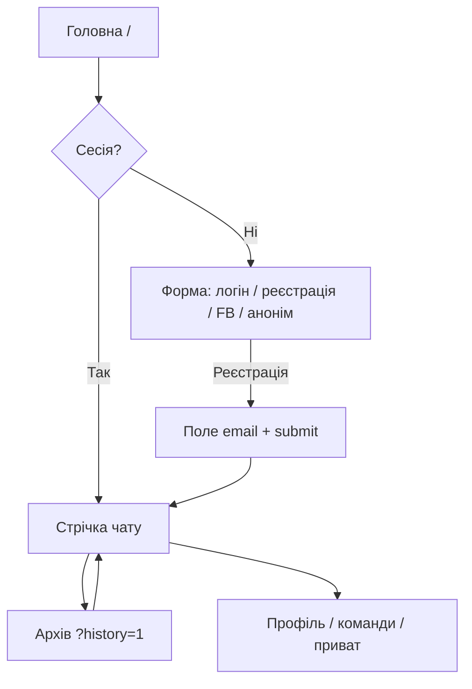

# Чат [board.te.ua](https://www.board.te.ua/) — будова сайту (огляд)

**Оновлено:** 2026-03-20  
**Метод дослідження:** автоматизація через **Chrome DevTools MCP** (знімки екрана та знімок дерева доступності сторінки).  
**Обмеження:** зовнішні посилання не відкривались; описані лише сторінки та елементи на домені `board.te.ua` (окрім згадок про наявні посилання в інтерфейсі).

Після цього огляду ви матимете уявлення про структуру головної сторінки, вхід і реєстрацію, основний екран чату та режим архіву.

**Правий сайдбар чату (`#chat_panel`):** детальний розбір іконок, вкладок, меню користувача та пов’язаних панелей — у [CHAT-PANEL-SIDEBAR.md](CHAT-PANEL-SIDEBAR.md).

**Стрічка, поле вводу, смайли, файли:** [CHAT-MAIN-INPUT.md](CHAT-MAIN-INPUT.md).

**Приватні повідомлення (нік, аватарка, сайдбар, API):** [PRIVATE-MESSAGES.md](PRIVATE-MESSAGES.md).

**База даних (таблиці, поля, логічні зв’язки):** [DATABASE-SCHEMA.md](DATABASE-SCHEMA.md) (дамп [org100h.sql](org100h.sql)).

---

## Скріншоти

| Файл | Що на знімку |
|------|----------------|
| [screenshots/01-home.png](screenshots/01-home.png) | Повна сторінка до/на старті (форма входу або залежно від сесії — чат). |
| [screenshots/02-after-registration.png](screenshots/02-after-registration.png) | Повна сторінка після успішної реєстрації та входу — стрічка повідомлень. |
| [screenshots/03-archive-history.png](screenshots/03-archive-history.png) | Клік по «Архів чату» з основного інтерфейсу (перехідний стан). |
| [screenshots/04-history-mode.png](screenshots/04-history-mode.png) | Режим **Архів чату** (`?history=1`), вікно перегляду. |
| [screenshots/05-chat-viewport.png](screenshots/05-chat-viewport.png) | Фрагмент інтерфейсу чату (viewport) після повернення на головну. |

---

## 1. Головна сторінка (неавторизований вигляд)

**Заголовок сторінки:** «Чат Рудої Панди - Тернопільський Анонімний Чат».

### Верх і брендинг

- Логотип/зображення «Чат Рудої Панди» (`/upload/orange.png`) з посиланням на головну.
- Заголовки: **Чат Рудої Панди**, підзаголовок **Український онлайн чат**.

### Форма входу

- Поле **Ім'я користувача**.
- Поле **Пароль**.
- Текст **забули пароль?** (підказка для відновлення).
- Дії (візуально сусідні блоки): **Увійти**, перемикач на **Реєстрація** (після натискання з’являється поле **e-mail** і форма надсилається кнопкою відправки форми).
- Кнопка **Увійти з facebook** — вхід через Facebook (зовнішній сервіс; у цьому огляді не використовувався).
- Посилання **Зайти анонімно** — швидкий вхід без облікового запису.

### Блок опису та навігація по екосистемі

- Текст про «Руду панду», тернопільський анонімний онлайн чат, чат зізнань тощо.
- Посилання в списку (на сторінці присутні, зовнішні URL не відкривались):
  - **Форум** → `weekdays.te.ua`
  - **Чат зізнання** / рулетка → `random.board.te.ua`
  - **Архів Чату** → `https://www.board.te.ua/?history=1` (той самий сайт)

### Онлайн

- Блок **Користувачі онлайн** з числом активних (на момент знімка — динамічне значення).

---

## 2. Реєстрація

1. На формі входу обрати режим **Реєстрація** (з’являється поле **e-mail**).
2. Заповнити **Ім'я користувача**, **Пароль**, **e-mail**.
3. Надіслати форму (кнопка submit у формі; підпис може дублювати текст «Реєстрація»).

**Результат у тестовому проходженні:** після відправки відкрився повноцінний інтерфейс чату; з’явилося системне повідомлення на кшталт «*нік* До нас прийшов» (вітання нового учасника в стрічці).

> **Безпека документації:** паролі та реальні поштові скриньки тестового акаунта тут не дублюються. Для повторення сценарію створіть власний тестовий обліковий запис.

---

## 3. Інтерфейс чату (авторизований користувач)

### Стрічка повідомлень

- Повідомлення у вигляді списку: аватар (з `/avatar/…`), **нік**, текст, час.
- Підтримуються **відповіді/цитування** (у стрічці видно конструкції на кшталт `нік > текст відповіді`).
- Медіа: посилання на зображення з `board.te.ua/upload/…`, емодзі/гифки з `/emoticon/…`, інколи вбудовані відео (наприклад YouTube у iframe в тілі чату — зовнішній плеєр).

### Нижня панель (ввід)

- **Поле повідомлення** з підказкою: *«Повідомлення (Жміть кнопу ⇧ щоб поправити останні повідомлення)»* — тобто **Shift** дозволяє редагувати останні відправлені повідомлення.
- Кнопка надсилання (іконка «літак» / submit).
- Додаткові іконки в зоні вводу (смайли, вкладення тощо — Font Awesome-стиль кнопок у дереві доступності).

### Верхня/бічна навігація чату

- **Архів Чату** (`?history=1`) — табличний перегляд історії.
- **Мої картинки** — якір `#` на тому ж origin (управління завантаженими зображеннями).
- **Чат рулетка** — посилання на `random.board.te.ua` (не відкривалось).
- Ряд іконок (домівка, профіль, пошук, список учасників, приватні повідомлення тощо) — швидкий доступ до розділів без перезавантаження в класичному вигляді SPA.

### Список учасників

- Відображаються ніки онлайн-користувачів; поруч елементи дій (наприклад додавання в приват або друзі — іконки «плюс» / статуси).

### Реклама та банери

- На сторінці **Архів** присутні блоки **Google AdSense** (iframe «Advertisement») та кнопка **Налаштування конфіденційності та файлів cookie** (CMP).

### Банер форуму

- Посилання **Форум WeekDays** з банером (`/upload/wee_banner.png`) — веде на `weekdays.te.ua` (не відкривалось).

---

## 4. Панель профілю та довідка по командах

У бічній/модальній зоні доступні вкладки-кнопки:

| Кнопка | Призначення |
|--------|-------------|
| **Персональна інформація** | Редагування профілю, аватар. |
| **Інформація про акаунт** | Дані облікового запису. |
| **соц.мережі** | Прив’язка соцмереж. |

**Аватар:** кнопки **Вибрати файл**, **Оновити**, **Оновлення інформації**.

### Текстові команди в чаті (з інтерфейсу довідки)

**Команда Статус**

- `/away` — статус «відійшов».

**Спеціальні повідомлення**

- `/me Текст` — дія/опис від першої особи.
- `/seen ім'я` — активність користувача.
- `/msg ім'я Текст` — особисте повідомлення.
- `/friend ім'я` — додати до друзів.

**Приватний чат**

- `/clear` — очистити приват.
- `/ignore ім'я` — ігнор користувача.
- `/ignoreclear` — скинути список ігнору.

---

## 5. Архів чату (`https://www.board.te.ua/?history=1`)

**Заголовок:** «Чат Рудої Панди - Тернопільський Анонімний Чат - Архів Чату».

- Підзаголовок з поясненням: простий інтерфейс, рекомендація користуватись **пошуком**.
- **Показати N дописів на сторінку** — випадаючий список: 10 / 25 / 50 / 100.
- Поле **Пошук**.
- Таблиця колонок: **Користувач** | **Повідомлення** | **Дата**.
- Пагінація: **Перша**, **Попередня**, **Наступна**, **Остання**; індикатор на кшталт «Сторінка 1 з 200».

---

## 6. Технічні спостереження (коротко)

- Основний контент завантажується з `https://www.board.te.ua/`; статичні ресурси — `/upload/`, `/avatar/`, `/emoticon/`.
- Частина функцій реалізована як односторінковий досвід (перемикання форми входу/реєстрації без повної зміни макету).
- Живі оновлення чату відображаються в зонах з роллю `log` та `live="assertive"` у знімку доступності — типова ознака оновлення стрічки в реальному часі.

---

## 7. Карта сценаріїв для читача

---

*Документ призначений для внутрішнього/технічного опису UI; контент повідомлень у чаті належить користувачам і в огляд не нормується.*
