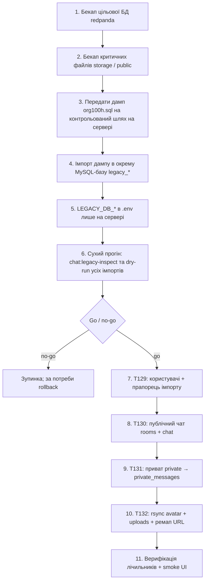

# T128 — Production runbook: імпорт legacy (org100h / board.te.ua)

**Задача:** [project-tasks/chat-v2-tasklist.md](../../project-tasks/chat-v2-tasklist.md) — **T128**.  
**Мета:** узгоджений **покроковий** процес для **production** без секретів у git: бекап, окрема legacy-БД, сухі прогони, порядок **T129 → T130 → T131 → T132**, критерії rollback.

**Операційне середовище:** команди виконуються на **цільовому сервері redpanda** (або з адмінської станції з доступом SSH/rsync до **board.te.ua**). Підставляйте реальні хости, користувачів SSH і шляхи **лише в runbook оператора / секретному сховищі**, не в репозиторії.

---

## Алгоритм (1 → N)



### 1. Бекап цільової БД redpanda

- Зніміть **повний** дамп або знімок згідно з політикою **T80/T83** (інструменти: `mysqldump`, керовані бекапи — поза цим файлом).
- Переконайтеся, що відновлення з бекапу **перевірене** на staging.

### 2. Бекап файлів

- Каталоги завантажень / згенеровані файли, які не відновлюються з git (див. **T132** для `storage` і публічних шляхів медіа).

### 3. Передача дампу `org100h.sql`

- Приклад **без** реальних облікових даних:

```bash
# З машини оператора (приклад):
scp /secure/local/org100h.sql DEPLOY_USER@REDPANDA_HOST:/secure/incoming/org100h.sql
```

- Дамп містить **PII** — обмежте права на файл (`chmod 600`), не кладіть у world-readable каталоги.

### 4. Окрема база `legacy_*` (не змішувати з `DB_DATABASE`)

- Створіть БД наприклад `legacy_org100h` **лише для читання** ETL.

```bash
mysql -h DB_HOST -u DBA_USER -p -e "CREATE DATABASE IF NOT EXISTS legacy_org100h CHARACTER SET utf8mb4 COLLATE utf8mb4_unicode_ci;"
mysql -h DB_HOST -u DBA_USER -p legacy_org100h < /secure/incoming/org100h.sql
```

- **`DB_DATABASE`** додатку redpanda залишається **окремою** цільовою схемою; дані legacy **не** імпортують у неї напряму на цьому кроці.

### 5. Налаштування `LEGACY_DB_*` у `.env` (тільки на сервері)

- Приклад (значення **не** комітити):

```env
LEGACY_DB_HOST=127.0.0.1
LEGACY_DB_PORT=3306
LEGACY_DB_DATABASE=legacy_org100h
LEGACY_DB_USERNAME=...
LEGACY_DB_PASSWORD=...
```

- Деталі з’єднання: `backend/config/database.php` → connection `legacy`. Огляд staging-процедури: [T13-ETL-STAGING.md](T13-ETL-STAGING.md).

### 6. Сухий прогін (обов’язково перед записом у цільову БД)

З каталогу `backend/`:

```bash
php artisan chat:legacy-inspect
php artisan chat:legacy-import-production --dry-run
# Після реалізації T131:
php artisan chat:legacy-import-private --dry-run
# Після реалізації T132:
php artisan chat:legacy-remap-board-urls --dry-run
```

- Перевірте лічильники, сироти в звіті **inspect**, відсутність несподіваних нулів.
- **Go / no-go:** уповноважена особа фіксує рішення в журналі змін (поза git).

### 7–10. Реальний імпорт у погодженому порядку

| Крок | Задача | Команди / артефакти |
|------|--------|---------------------|
| 7 | **T129** | Міграція користувачів з прапорцем `legacy_imported_at`; пароль / скидання — [T111-LEGACY-PASSWORDS.md](T111-LEGACY-PASSWORDS.md), UX — екран скидання (**T129**). |
| 8 | **T130** | `php artisan chat:legacy-import-production` з **`--force`** на prod за рішенням; політика: **порожні** `users` / `rooms` / `chat` у цільовій БД (див. [T130-LEGACY-PUBLIC-CHAT-IMPORT.md](T130-LEGACY-PUBLIC-CHAT-IMPORT.md)). |
| 9 | **T131** | `php artisan chat:legacy-import-private` — мапінг у [T131-LEGACY-PRIVATE-IMPORT.md](T131-LEGACY-PRIVATE-IMPORT.md). |
| 10 | **T132** | rsync **avatar** і **uploads** з board.te.ua; ремап URL — [T132-LEGACY-MEDIA-MIGRATION.md](T132-LEGACY-MEDIA-MIGRATION.md). |

- **SSH до legacy-хоста** (приклад узагальнено): `ssh …@board.te.ua` — ключі в агенті, **BatchMode** для скриптів; деталі rsync — [T113-LEGACY-AVATARS.md](T113-LEGACY-AVATARS.md) та **T132**.

### 11. Верифікація

- SQL: порівняння кількостей `users`, `rooms`, `chat`, `private_messages` з очікуваннями з dry-run / legacy inspect.
- UI: вхід тестових акаунтів, стрічка кімнати, приват, відображення зображень після **T132**.

---

## Ризики та rollback

| Ризик | Мітигація |
|-------|-----------|
| Перезапис prod-даних | Окрема `legacy_*` БД; цільова БД — лише після бекапу; команди імпорту з **`--dry-run`** спочатку; на prod — **`--force`** лише за явним рішенням. |
| Змішання схем | Не імпортувати `org100h.sql` у `DB_DATABASE` без окремого плану міграції. |
| Втрата цілісності FK | Порядок **T129 → T130 → T131**; сироти логуються в звітах команд. |
| Недостатньо місця для медіа | Перед **T132**: `df`, оцінка розміру `/var/www/board.te.ua/html/avatar` та `uploads`. |

**Порядок відкату (типово):**

1. Відновити цільову БД з бекапу кроку **1** (найшвидший спосіб скасувати зміни T129–T131).
2. Видалити / відкотити скопійовані файли медіа та повторно застосувати ремап (або відновити бекап файлів кроку **2**), якщо зачепили **T132**.

**`--force`:** дозволяє лише уповноважений оператор після go/no-go; хто саме — фіксується в політиці деплою (**T80/T83**).

---

## Пов’язані документи

- [T13-ETL-STAGING.md](T13-ETL-STAGING.md) — staging, обмеження паролів і обсягу T13.
- [T113-LEGACY-AVATARS.md](T113-LEGACY-AVATARS.md) — фільтр користувачів і rsync аватарок.
- [T130-LEGACY-PUBLIC-CHAT-IMPORT.md](T130-LEGACY-PUBLIC-CHAT-IMPORT.md), [T131-LEGACY-PRIVATE-IMPORT.md](T131-LEGACY-PRIVATE-IMPORT.md), [T132-LEGACY-MEDIA-MIGRATION.md](T132-LEGACY-MEDIA-MIGRATION.md).

---

## Tabletop-чекліст для оператора (без PII у git)

- [ ] Прочитано цей runbook і [T13-ETL-STAGING.md](T13-ETL-STAGING.md).
- [ ] Є актуальний бекап цільової БД і знання, як відновити.
- [ ] `LEGACY_DB_*` виставлені лише на сервері; дамп не у публічних каталогах.
- [ ] Виконано `chat:legacy-inspect` і всі **dry-run** перед записом.
- [ ] Відомо, хто уповноважений на `--force` на production.
