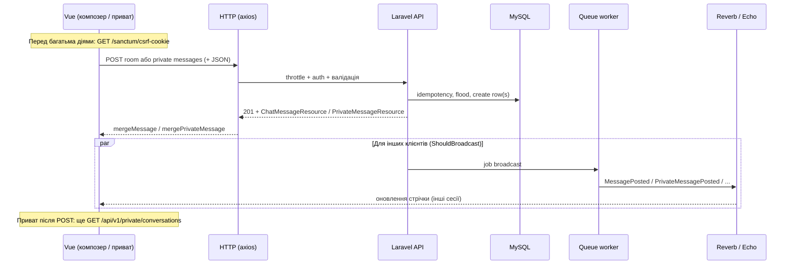

# T161 — Повільна мережа: ланцюг відправки повідомлення (чат)

**Епік:** T160 (PWA)  
**Статус:** baseline до оптимізацій (**T162** реалізує узгоджені пункти з беклогу нижче).  
**Кодова база:** `backend/` (Laravel API + Vue 2.7 SPA).

---

## 1. Методика вимірювання (відтворювані кроки)

### 1.1 Chrome DevTools

1. Відкрити застосунок чату на **HTTPS** (локально або staging), увійти під тестовим користувачем.
2. **DevTools → Network** — увімкнути **Preserve log**, за бажанням **Disable cache** (для повторюваності).
3. **Throttling:** пресет **Slow 3G** або кастомний профіль (наприклад, download ~400 kbit/s, upload ~400 kbit/s, latency 400 ms) — узгодити з командою і **не змінювати** між baseline (T161) і порівнянням після T162.
4. Очистити мережевий журнал, виконати сценарій (нижче), зупинити запис.
5. Для кожного цікавого запиту зафіксувати в таблиці: **Waiting (TTFB)**, **Content Download**, **Time** (total), розмір **Request** / **Response** (Headers + payload).

### 1.2 Сценарії (обов’язкові для звіту T162)

| ID | Сценарій | Дії |
|----|-----------|-----|
| R1 | Кімната, лише текст | Відкрити кімнату, надіслати коротке повідомлення без зображення та без `/`-команд. |
| R2 | Кімната + зображення | Вкласти файл (або вставити з буфера), дочекатися завершення аплоаду прев’ю, надіслати повідомлення з `image_id`. |
| P1 | Приват (панель), текст | Відкрити приват з користувачем, надіслати коротке повідомлення. |
| R3 | (Опційно) Інлайн `/msg` | Повідомлення, що створює інлайн-приват у стрічці кімнати + запис у приватах — для порівняння складності сервера та подій. |

---

## 2. Ланцюг виконання (фази)

Нижче — фактичний потік у поточній реалізації (без optimistic UI для відправника).

### 2.1 Таблиця фаз

| Фаза | Кімната (основний POST) | Приват (панель) | Примітки з коду |
|------|-------------------------|-----------------|-----------------|
| **Клієнт: валідація / стан** | `ChatRoomComposer.getSendPayload()` + перевірки в `sendMessage()` | `sendPrivateMessageFromPanel` — trim, `/clear` | Немає «pending» повідомлення в стрічці до відповіді сервера. |
| **Клієнт: мережа до POST** | `await ensureSanctum()` → **GET `/sanctum/csrf-cookie`**, потім **POST** `/api/v1/rooms/{segment}/messages` | Те саме `ensureSanctum`, потім **POST** `/api/v1/private/peers/{id}/messages` | Кожна відправка викликає окремий round-trip на CSRF перед основним запитом. |
| **Клієнт: зображення (R2)** | Окремо **POST** `multipart` `/api/v1/images` (FormData), далі POST повідомлення з `image_id` | У панелі привату — лише текст у поточному UI | Два послідовні важкі запити на повільному uplink. |
| **HTTP** | JSON: `message`, `client_message_id` (UUID), опційно `style`, `image_id` | JSON: `message`, `client_message_id` | Маршрути: `throttle:chat-post` / `throttle:private-post` (`routes/api.php`). |
| **Сервер** | `ChatMessageController@store`: posting gate, duplicate `client_message_id`, flood, slash/automod, транзакції для `/msg`, `ChatMessage::create` | `PrivateMessageController@store`: блоки, duplicate, flood, `PrivateMessage::create` | Ідемпотентність: унікальність `(user_id, client_message_id)` / `(sender_id, client_message_id)`. |
| **Відповідь** | `ChatMessageResource` + `meta.slash` | `PrivateMessageResource` + `meta.duplicate` | Відправник отримує повний об’єкт у тілі відповіді. |
| **Real-time** | `broadcast(new MessagePosted($message))->toOthers()` — отримувачі в `room.{id}` | `broadcast(new PrivateMessageCreated($message))` → `user.{recipient_id}` | Події реалізують `ShouldBroadcast` → у проді зазвичай **черга** (`QUEUE_CONNECTION=database` у `.env.example`), не миттєвий WS. |
| **Оновлення стрічки (відправник)** | `mergeMessage(data.data)` після успішного POST | `mergePrivateMessage` + **`await loadConversations()`** → **GET `/api/v1/private/conversations`** | У приваті після кожної відправки — **додатковий** повний round-trip для списку розмов. |
| **Real-time (відправник, кімната)** | Echo `.MessagePosted` зазвичай не дублює власне повідомлення (`toOthers`) | WS може прийти відправнику для синхронізації списку/звуку | Дедуп у `mergeMessage` за `post_id` / множиною id. |

Ключові точки входу у фронті: `ChatRoom.vue` (`sendMessage`, `setupEcho`), `chatRoomPrivateMethods.js` (`sendPrivateMessageFromPanel`, `loadConversations`), `ChatRoomComposer.vue` (`uploadChatImageFile` → `/api/v1/images`).

---

## 3. Зафіксована серія метрик (baseline, до T162)

**Серія A (таймінги, ms):** шаблон для знімку в Chrome DevTools; заповнити на staging/local під обраний throttling-профіль (той самий — у T162 для «до/після»).

| Сценарій | Запит (приклад) | Waiting (ms) | Download (ms) | Total (ms) | Request size | Response size |
|----------|-----------------|-------------:|---------------:|-----------:|-------------:|--------------:|
| R1 перша відправка після завантаження | `GET /sanctum/csrf-cookie` + `POST .../rooms/.../messages` | *зняти в DevTools* | *зняти* | *зняти* | ~200–400 B JSON (текст) | ~0.5–2 KB JSON (оцінка за ресурсом) |
| R1 наступні відправки | Лише `POST .../messages` (якщо CSRF не форсує новий запит) | *зняти* | *зняти* | *зняти* | як вище | як вище |
| R2 | `POST /api/v1/images` + `POST .../messages` | *зняти* | *зняти* | *зняти* | multipart (файл) + JSON | JSON + URL зображення в ресурсі |
| P1 | `GET /sanctum/csrf-cookie` + `POST .../private/.../messages` + `GET .../conversations` | *зняти* | *зняти* | *зняти* | 2× JSON + список розмов | залежить від кількості чатів |

**Серія B (відтворювана без браузера): кількість послідовних HTTP round-trips на критичному шляху** — зчитано з потоку викликів `ensureSanctum` → відправка → (`loadConversations` для привату) / (`uploadChatImageFile` для R2):

| Сценарій | Мінімум послідовних RTT | Джерело |
|----------|-------------------------|---------|
| R1 кімната | **2** (`GET /sanctum/csrf-cookie`, `POST .../messages`) | `ChatRoom.vue` → `sendMessage` |
| R1 (якщо GET CSRF відпрацьовує з кешу) | **1** (лише POST) | Залежить від кешу; у коді запит лишається |
| P1 приват | **3** (CSRF + POST private + `GET /api/v1/private/conversations`) | `chatRoomPrivateMethods.js` → `sendPrivateMessageFromPanel` |
| R2 кімната + новий файл | **3+** (CSRF + `POST /api/v1/images` + `POST .../messages`) | `ChatRoomComposer.vue` → `uploadChatImageFile` + `sendMessage` |

**Обов’язкове доповнення для порівняння з T162:** заповнити той самий шаблон рядків у **Slow 3G** (або кастомному профілі) на цільовому середовищі та зберегти скрін Network / HAR у `docs/chat-v2/artifacts/` (назву узгодити в PR до T162).

**Висновок по вузьких місцях (код + архітектура, незалежно від точних ms):**

1. **Послідовний CSRF** перед кожною відправкою — зайвий RTT на повільних каналах.
2. **Немає optimistic UI** — користувач чекає повну відповідь API, перш ніж повідомлення стабільно в стрічці.
3. **Зображення:** окремий аплоад + POST повідомлення — подвоєний uplink-час.
4. **Приват:** обов’язковий **`loadConversations()`** після успішного POST — ще один RTT після відправки.
5. **Broadcast через чергу** — інші учасники кімнати можуть бачити повідомлення пізніше за HTTP-відповідь відправника, якщо worker відстає (важливо для сприйняття «затримки чату»).

---

## 4. Пріоритизований беклог оптимізацій (для T162)

### P0 — найвищий вплив при обмеженій смузі

| # | Пункт | Обґрунтування |
|---|--------|----------------|
| P0-1 | Зменшити або умовно пропускати `ensureSanctum()` перед відправкою, якщо сесія / CSRF уже валідні (з обережністю до 419). | Прибирає цілий RTT з критичного шляху. |
| P0-2 | **Приват:** не блокувати UI на `await loadConversations()` після відправки; оновлювати список розмов у фоні або інкрементально з відповіді POST / WS. | Зараз — послідовні два (або три з CSRF) запити. |
| P0-3 | Розглянути **optimistic** рядок у стрічці (з тимчасовим id + узгодженням з `post_id` / `client_message_id` після 201) для кімнати та/або привату. | Покращує сприйняття затримки без зменшення серверного часу. |
| P0-4 | Перевірити прод-налаштування: **`QUEUE_CONNECTION`**, час обробки broadcast jobs, Reverb — щоб WS не відставав від REST для інших клієнтів. | Уникає «повідомлення є в БД, але стрічка оновилась із запізненням». |

### P1

| # | Пункт | Обґрунтування |
|---|--------|----------------|
| P1-1 | Зображення: прогресивний UX (показ локального прев’ю вже є; розглянути об’єднання або pipeline upload+message, якщо API дозволить без порушення модерації). | Менше «мертвого часу» між діями користувача. |
| P1-2 | Retry з **тим самим `client_message_id`** при мережевих збоях (axios interceptors / кнопка «Повторити») з відображенням стану. | Вже підтримано сервером для ідемпотентності — можна краще використати на клієнті. |
| P1-3 | Індикатор відправки / черги (вже є `sending` / `sendingPrivate` — узгодити з довгими таймаутами на Slow 3G). | Менше повторних кліків і дубльованих спроб. |

### P2

| # | Пункт | Обґрунтування |
|---|--------|----------------|
| P2-1 | Стискання / мінімізація полів у JSON відповіді, якщо зайві для клієнта після відправки. | Невеликий виграш на дуже повільних лініях. |
| P2-2 | HTTP/2 / TLS session resumption на edge (інфраструктура). | Зменшує накладні витрати на повторні запити. |

---

## 5. Зв’язок із наступними задачами

- **T162** — реалізація узгоджених з PR пунктів з розділу 4; регресія `client_message_id`, кімната + приват, мережеві помилки; за змінами API — `docs/chat-v2/openapi.yaml`.
- Повторне вимірювання: той самий профіль throttling і сценарії R1/R2/P1, таблиця «після» поруч із baseline з розділу 3.
